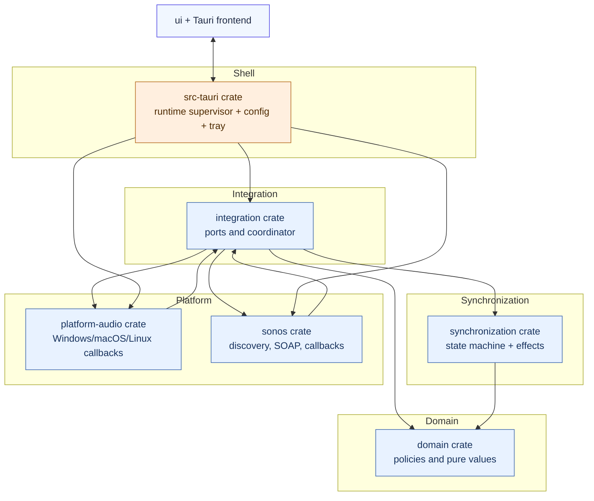
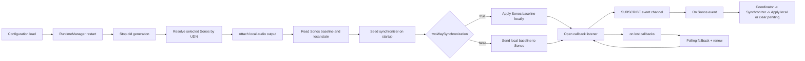
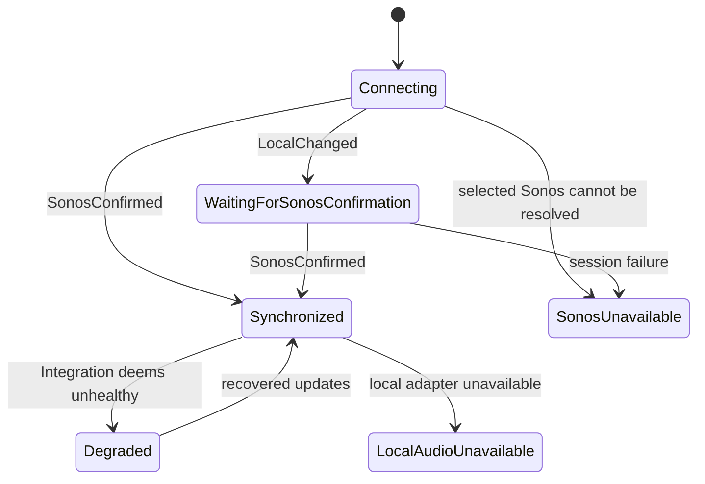

# Architecture

## System model

SonosVolumeBridge keeps one chosen Sonos player and one local output device in synchronization.

## Architectural layers

- `domain`: policy and data model only. No Tauri, OS APIs, or networking.
- `synchronization`: policy machine. It processes normalized local and Sonos events and emits desired side effects.
- `integration`: async coordinator and port abstractions.
  - coalesces local volume updates through bounded channels,
  - deduplicates repeated Sonos command writes,
  - applies optional mute mapping,
  - updates timing metrics.
- `sonos`: local-network client for SSDP, SOAP, GENA subscribe/renew/unsubscribe, and callback listener validation.
- `platform-audio`: OS adapters for local output change events and setting local volume or mute.
  Linux uses PulseAudio's `pactl` interface, which is also supplied by PipeWire on Ubuntu.
- `src-tauri`: composition root.
  - reads validated settings,
  - owns runtime lifecycle and tray status snapshots,
  - hosts command surface for frontend actions.

## Runtime lifecycle

## State and direction behavior

There are three related layers of state:

- Domain synchronization state (`domain::SyncState`): `Connecting`, `Synchronized`,
  `WaitingForSonosConfirmation`, `Degraded`.
- Integration health mode (`integration::Health`): `Healthy`,
  `SubscriptionDegraded`, `PollingFallback`.
- UI/runtime status: `Connecting`, `Synchronized`, `SonosUnavailable`,
  `LocalAudioUnavailable`, `UnsupportedLocalDevice`, and related states.

## Directional model

Synchronization direction is explicit:

- Two-way mode (default): Sonos confirmation maps back to local output.
- One-way mode: local output remains authoritative; local values are pushed to Sonos.

Both modes still enforce local intent deduplication and Sonos confirmation authority.

## Mapping and policy knobs

- `mapping`: `linear`, `cappedLinear`, or `piecewise`.
- `maximumSonosVolume`: global safety cap before write.
- `synchronizeMute` and `muteSpeakerAtZeroVolume`: mute behavior.
- `followDefaultAudioDevice` vs `fixedAudioDeviceId`: local endpoint selection.
- `fallbackPolling`: event loss handling strategy.

## Data safety boundaries

- No direct filesystem, network, or Sonos protocol action from the frontend.
- Protocol URLs and callback targets are validated before network calls.
- Diagnostics and frontend status are redacted and human friendly.
- Configuration writes are atomic with `.json.tmp` staging and schema validation.

The protocol adapter uses Reqwest 0.13 and quick-xml 0.42. XML decoding is
performed by the streaming reader; protocol parsing retains explicit reference
unescaping and typed errors. See [ADR 0002](decisions/0002-local-sonos-client.md).

The settings form shares behavior across platforms while selecting separate
macOS, Windows, and Linux presentation styles in the frontend. See
[ADR 0012](decisions/0012-platform-settings-presentation.md).
macOS dropdown sizing runs after saved selections are restored during form mounting.

Windows uses a dedicated, scoped stylesheet and platform window configuration
for its resizable Windows 11 Settings presentation. OS-specific presentation
does not change the shared settings controls or synchronization lifecycle.

The shell preloads optional tray speaker controls asynchronously at startup and
refreshes them when connection state changes or the tray is clicked. Network
reads never block the menu event handler; menu updates run on the main thread.

Settings refreshes are asynchronous and guarded against edits and pending writes.
Speech Enhancement chooses the same model-appropriate EQ for reads and writes;
see [ADR 0009](decisions/0009-sonos-speaker-controls.md).

The Sonos adapter derives per-control availability from validated read responses,
model-specific EQ selection and advertised services. The shell forwards this
alongside current values. Unsupported and temporarily unavailable remain distinct;
event omissions never remove capabilities. No networking enters the domain or
synchronization crates.

Runtime volume/mute/status changes are pushed to Settings immediately; the one-second
cached snapshot poll remains a UI-delivery backup. Volume-only and mute-only GENA
notifications trigger authoritative reads rather than being rejected. With fallback
polling enabled, fixed-deadline speaker health reads run every five seconds when
subscribed and every second when unsubscribed, updating both synchronization and
visible diagnostics. Optional settings also receive periodic backup refreshes,
including controls that do not publish RenderingControl events.

Slider gestures preview locally and commit on release (keyboard: key release).
Active gestures block background form replacement and control refresh. Settings
writes from explicit user actions are serialized; device reads only update display
properties, never dispatch input/change events or enqueue writes. Existing audio
origin/expected-write suppression remains in the synchronization adapters. Sonos
notifications do not identify the originating controller, so an echoed value is
not treated as proof of authorship and genuine external changes remain observable.

## Global Night Mode scheduling

A separate shell worker applies one global weekly half-hour schedule exclusively
to the selected compatible speaker. Pure calendar calculation lives in `domain`;
read/confirm/enforce policy lives in the integration Night Mode controller. It does
not enter the volume synchronization state machine. Native wake and notification
adapters stay in the shell. A shared configuration/Night Mode write gate prevents
selection races, while volume synchronization continues independently. See
[ADR 0013](decisions/0013-global-night-mode-schedule.md).

Tray speaker controls retain their native menu objects for the tray lifetime.
Refreshes update values in place; capability changes only attach or detach cached
objects, preserving action targets while the OS is dispatching menu clicks.

Desktop clock formatting is read by the shell adapter: Foundation on macOS,
GetLocaleInfoEx on Windows, and GNOME clock-format/LC_TIME on Linux. The frontend
applies that preference to both axis labels and interval tooltips. The shared
rectangular editor and scheduler are used on all three platforms.

Windows schedule tooltips use an opaque platform surface in both color schemes;
the shared hover interaction remains in the frontend (ADR 0013).

## Hardware-free UI demo

Demo startup assigns a distinct runtime package name as well as application
identifier. Windows/Linux login registration uses the package name, preserving
the normal application's autostart entry when demo login settings change.

The default-off `ui-demo` debug feature runs the normal shell and native commands
against a loopback Sonos simulator. Discovery and resolution select only this
simulated device; SOAP and GENA use the production client. The scheduler, tray,
local audio and synchronization services remain active. Demo configuration and
logs use a separate app identity. Browser previews alone use the frontend mock.
See [ADR 0014](decisions/0014-ui-demo-build.md).

Night schedule notifications share the shell's speaker display-name normalization
with device selection; notification bodies never need the renderer suffix to
identify a speaker. This applies to both scheduled boundaries and Save confirmations.

Linux settings use a shared Ubuntu/Yaru-inspired presentation on x86-64 and
ARM64, with a 1080-pixel fixed-width native window, an 800-pixel default height and
responsive grouped controls. Vertical resizing remains available.
The platform stylesheet stays inside the frontend; the shell selects Linux
window bounds through `tauri.linux.conf.json`. See ADR 0012.

The Linux tray adapter uses a white icon for Ubuntu's dark top bar independently
of the application color scheme, retaining the disconnected badge (ADR 0012).
