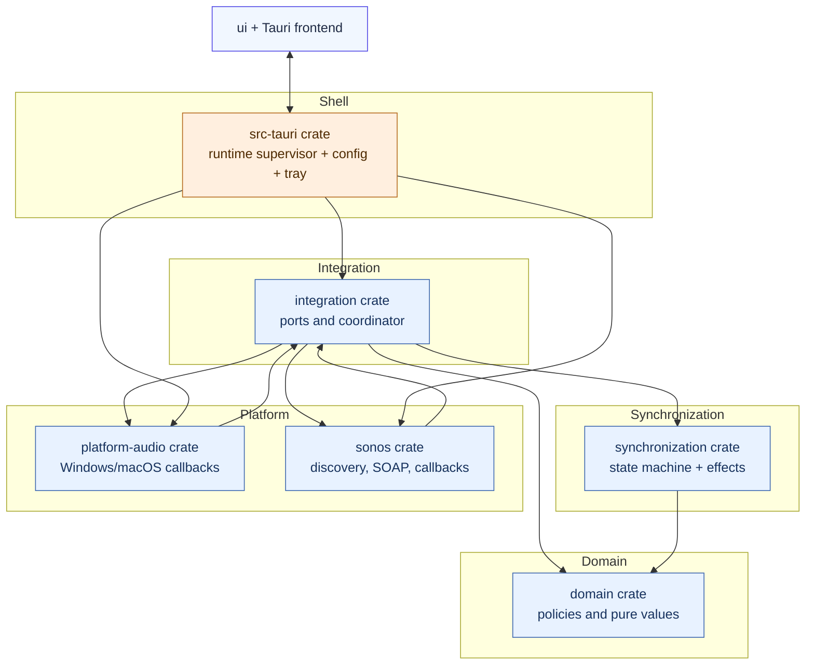
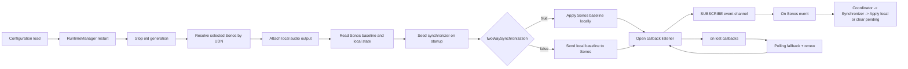
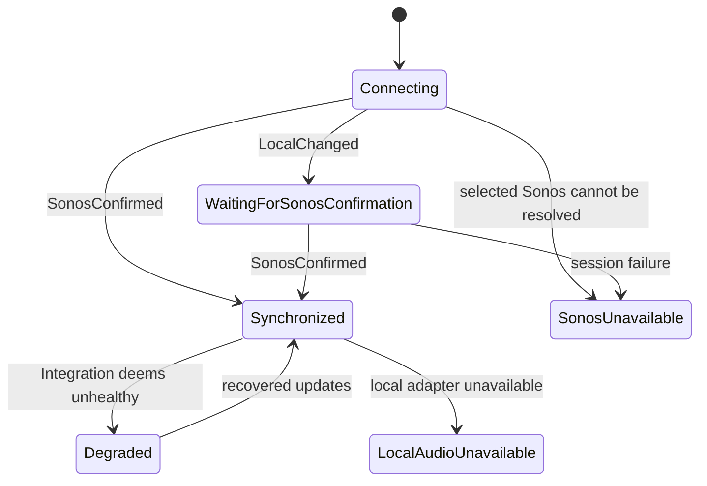

# Architecture

## System model

SonosVolumeBridge keeps one chosen Sonos player and one local output device in synchronization.

## Architectural layers

- `domain`: policy and data model only. No Tauri, OS APIs, or networking.
- `synchronization`: policy machine. It processes normalized local and Sonos events and emits desired side effects.
- `integration`: async coordinator and port abstractions.
  - coalesces local volume updates through bounded channels,
  - deduplicates repeated Sonos command writes,
  - applies optional mute mapping,
  - updates timing metrics.
- `sonos`: local-network client for SSDP, SOAP, GENA subscribe/renew/unsubscribe, and callback listener validation.
- `platform-audio`: OS adapters for local output change events and setting local volume or mute.
- `src-tauri`: composition root.
  - reads validated settings,
  - owns runtime lifecycle and tray status snapshots,
  - hosts command surface for frontend actions.

## Runtime lifecycle

## State and direction behavior

There are three related layers of state:

- Domain synchronization state (`domain::SyncState`): `Connecting`, `Synchronized`,
  `WaitingForSonosConfirmation`, `Degraded`.
- Integration health mode (`integration::Health`): `Healthy`,
  `SubscriptionDegraded`, `PollingFallback`.
- UI/runtime status: `Connecting`, `Synchronized`, `SonosUnavailable`,
  `LocalAudioUnavailable`, `UnsupportedLocalDevice`, and related states.

## Directional model

Synchronization direction is explicit:

- Two-way mode (default): Sonos confirmation maps back to local output.
- One-way mode: local output remains authoritative; local values are pushed to Sonos.

Both modes still enforce local intent deduplication and Sonos confirmation authority.

## Mapping and policy knobs

- `mapping`: `linear`, `cappedLinear`, or `piecewise`.
- `maximumSonosVolume`: global safety cap before write.
- `synchronizeMute` and `muteSpeakerAtZeroVolume`: mute behavior.
- `followDefaultAudioDevice` vs `fixedAudioDeviceId`: local endpoint selection.
- `fallbackPolling`: event loss handling strategy.

## Data safety boundaries

- No direct filesystem, network, or Sonos protocol action from the frontend.
- Protocol URLs and callback targets are validated before network calls.
- Diagnostics and frontend status are redacted and human friendly.
- Configuration writes are atomic with `.json.tmp` staging and schema validation.
