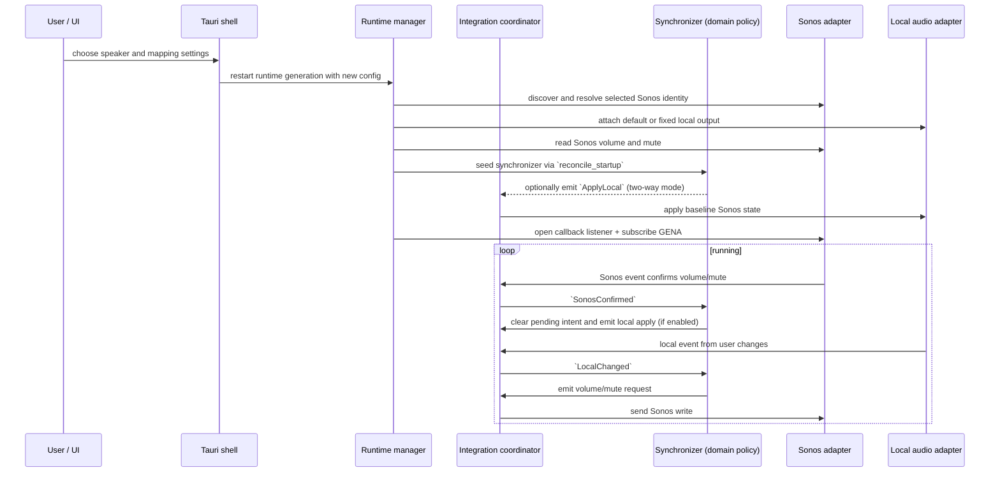

# How SonosVolumeBridge works

SonosVolumeBridge keeps one speaker and one local audio endpoint synchronized.

## End-to-end flow

## Startup and discovery

Configuration is loaded from JSON on startup and validated before it is used.
Speaker discovery uses SSDP in the local subnet and uses the cached description URL
first if it still matches the selected UDN.

At runtime startup, the selected endpoint is attached and the synchronizer is seeded
with the latest Sonos read.

## Synchronization strategy

Two modes are supported:

- Two-way mode: confirmed Sonos values are applied back to local output.
- One-way mode: local output remains the reference while Sonos follows local volume.

In both modes local volume changes are converted through the configured mapping and
issued as pending Sonos intents. A newer local intent replaces older pending
intents. Mute requests are always sent immediately.

## Eventing and fallback

The runtime uses GENA callbacks for prompt updates. Callback subscription is
validated against peer identity and active SID. If renewal or delivery becomes
unstable, the integration enters polling fallback and uses periodic reads until
callbacks are healthy again.

Renewal is scheduled at 80 percent of the subscription timeout. Backoff is used
for reconnection when session startup fails.

## Write suppression

Both Sonos and local adapters mark callback origin:

- Windows: callback context IDs.
- macOS: expected-write tracking with tolerance and expiry.
- Ubuntu: PulseAudio/PipeWire `pactl subscribe` events with expected-write tracking.

Suppressed local callbacks are ignored by the synchronizer so confirmed Sonos values
do not create write loops.

## Configuration inputs that affect behavior

- `twoWaySynchronization`: controls direction mode.
- `synchronizeMute`: includes mute as part of local intent application.
- `muteSpeakerAtZeroVolume`: forces muted state at local zero volume.
- `mapping`: `linear`, `cappedLinear`, or `piecewise`.
- `maximumSonosVolume`: global cap on Sonos target.
- `followDefaultAudioDevice` vs `fixedAudioDeviceId`: output selection strategy.
- `fallbackPolling`: enables fallback polling when callback-driven state is not
  healthy.

Settings can be saved on first launch with Start at login disabled. The login
service is contacted only when that option changes, so login-service errors do
not block unrelated settings updates.

Speaker sound controls update from local Sonos RenderingControl push notifications.
Settings-only events no longer require accompanying volume/mute fields. The app
reads the speaker after a notification and updates Settings and the tray. Focus
and page changes also refresh device data. Devices/settings without event support
remain dependent on these refreshes; subscription failures use a polling fallback.

Speaker controls show “Not supported by this speaker” only for an absent required
service or an explicit unsupported-action response. Failed or ambiguous reads show
“Temporarily unavailable” and are retried on refresh; they are not treated as off.
An off switch or zero tone value can still be fully supported. Detection performs
no setting writes.
