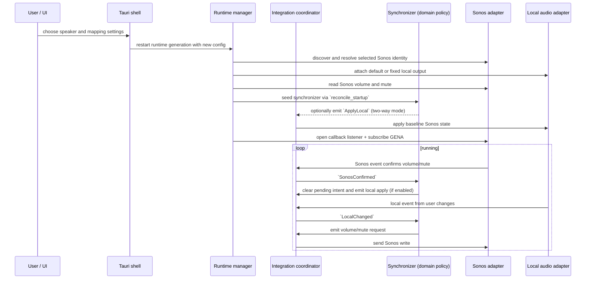

# How SonosVolumeBridge works

SonosVolumeBridge keeps one speaker and one local audio endpoint synchronized.

## End-to-end flow

## Startup and discovery

Configuration is loaded from JSON on startup and validated before it is used.
Speaker discovery uses SSDP in the local subnet and uses the cached description URL
first if it still matches the selected UDN.

At runtime startup, the selected endpoint is attached and the synchronizer is seeded
with the latest Sonos read.

## Synchronization strategy

Two modes are supported:

- Two-way mode: confirmed Sonos values are applied back to local output.
- One-way mode: local output remains the reference while Sonos follows local volume.

In both modes local volume changes are converted through the configured mapping and
issued as pending Sonos intents. A newer local intent replaces older pending
intents. Mute requests are always sent immediately.

## Eventing and fallback

The runtime uses GENA callbacks for prompt updates. Callback subscription is
validated against peer identity and active SID. If renewal or delivery becomes
unstable, the integration enters polling fallback and uses periodic reads until
callbacks are healthy again.

Renewal is scheduled at 80 percent of the subscription timeout. Backoff is used
for reconnection when session startup fails.

## Write suppression

Both Sonos and local adapters mark callback origin:

- Windows: callback context IDs.
- macOS: expected-write tracking with tolerance and expiry.
- Ubuntu: PulseAudio/PipeWire `pactl subscribe` events with expected-write tracking.

Suppressed local callbacks are ignored by the synchronizer so confirmed Sonos values
do not create write loops.

## Configuration inputs that affect behavior

- `twoWaySynchronization`: controls direction mode.
- `synchronizeMute`: includes mute as part of local intent application.
- `muteSpeakerAtZeroVolume`: forces muted state at local zero volume.
- `mapping`: `linear`, `cappedLinear`, or `piecewise`.
- `maximumSonosVolume`: global cap on Sonos target.
- `followDefaultAudioDevice` vs `fixedAudioDeviceId`: output selection strategy.
- `fallbackPolling`: enables fallback polling when callback-driven state is not
  healthy.

Settings can be saved on first launch with Start at login disabled. The login
service is contacted only when that option changes, so login-service errors do
not block unrelated settings updates.

Speaker sound controls update from local Sonos RenderingControl push notifications.
Settings-only events no longer require accompanying volume/mute fields. The app
reads the speaker after a notification and updates Settings and the tray. Focus
and page changes also refresh device data. Devices/settings without event support
remain dependent on these refreshes; subscription failures use a polling fallback.

Speaker controls show “Not supported by this speaker” only for an absent required
service or an explicit unsupported-action response. Failed or ambiguous reads show
“Temporarily unavailable” and are retried on refresh; they are not treated as off.
An off switch or zero tone value can still be fully supported. Detection performs
no setting writes.

Runtime volume/mute/status changes are pushed to Settings immediately; the one-second
cached snapshot poll remains a UI-delivery backup. Volume-only and mute-only GENA
notifications trigger authoritative reads rather than being rejected. With fallback
polling enabled, fixed-deadline speaker health reads run every five seconds when
subscribed and every second when unsubscribed, updating both synchronization and
visible diagnostics. Optional settings also receive periodic backup refreshes,
including controls that do not publish RenderingControl events.

Slider gestures preview locally and commit on release (keyboard: key release).
Active gestures block background form replacement and control refresh. Settings
writes from explicit user actions are serialized; device reads only update display
properties, never dispatch input/change events or enqueue writes. Existing audio
origin/expected-write suppression remains in the synchronization adapters. Sonos
notifications do not identify the originating controller, so an echoed value is
not treated as proof of authorship and genuine external changes remain observable.

## Night Mode schedule

Open **Night schedule** to edit one global schedule for the speaker selected on
Devices. The schedule only acts on compatible speakers. Switching speakers applies
the same schedule to the new selection without changing the previous speaker.
An unavailable or unsupported selection pauses scheduling and preserves the grid.

The gray editor shows Monday–Sunday rows and 48 half-hour columns across the full
day. Labels appear every three hours, through 21:00/9 PM, without repeating
midnight at the end. Hover tooltips appear after 100 ms. Click or press Space to
toggle a cell; arrow keys move between cells. Dragging creates a rectangle: starting
on an empty cell selects the whole rectangle; starting on a selected cell clears
it. Overlapping cells all take that same state. Dragging back shrinks the rectangle
and restores cells outside it to their state before the gesture.

**Save schedule** stores the grid and immediately applies its current block: on
inside a selected block, off outside. This one-shot action works even when recurring
scheduling is disabled and can be repeated without editing the grid. **Cancel**
restores the saved grid; **Clear all** edits the draft until saved. Background reads
and speaker selection changes preserve unsaved drafts.

**Enable schedule** saves immediately. During selected periods, the scheduler keeps
Night Mode on and rejects manual off. Disable scheduling first to use manual off;
disabling alone leaves Night Mode unchanged. Outside selected periods, manual
changes are allowed. Leaving a scheduled period turns Night Mode off once.
The tray has a checked **Night schedule** item directly above **Night sound**.
The checkmark represents enabled scheduling; the editor opens through Settings.

**Night schedule notifications** saves immediately and offers **On start**,
**On end**, **On start and end**, and **Never** (the default). Confirmed boundaries notify
only when their direction is selected. Save also tests the matching direction:
on counts as Start, off as End. Adjacent selected cells do not notify. Startup,
wake, recovery, selection changes, manual changes, and enforcement corrections
remain silent. Permission denial and OS notification suppression never stop
scheduling or volume synchronization.

Scheduling follows the machine's time zone. Startup, wake, reconnection, selection
changes, clock changes, and schedule enabling reconcile only the current expected
state; missed transitions are never replayed. Scheduling runs independently of
local audio availability and volume fallback polling.

Clock labels follow Foundation preferences on macOS, the regional time format on
Windows, and GNOME clock-format or LC_TIME on Linux. Preferences are reread when
Settings regains focus. Other Linux desktop-specific clock overrides may require
matching LC_TIME. The form omits repetitive disabled/outside-period status text;
errors, capability guidance, and active-period restrictions remain visible.
